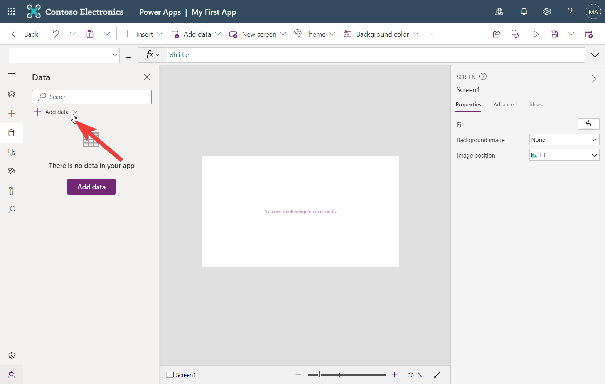
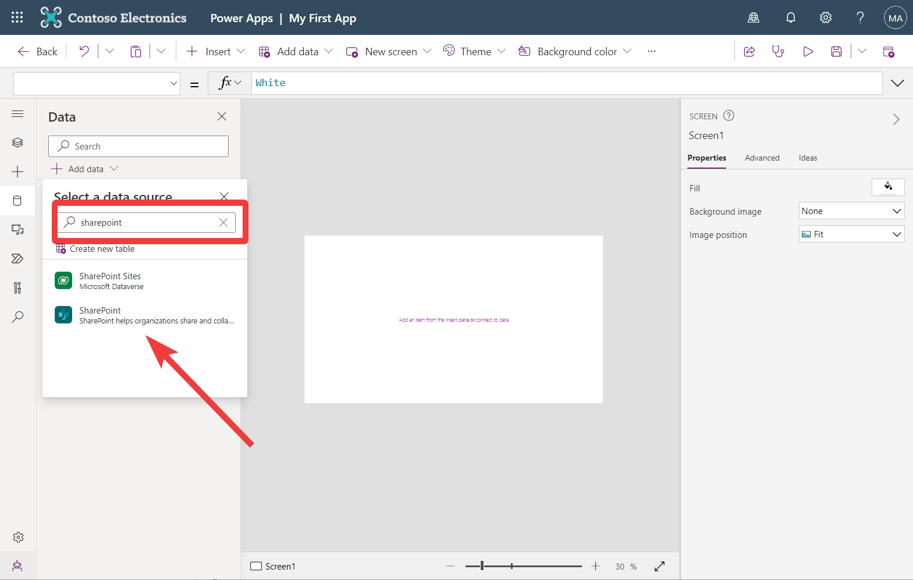
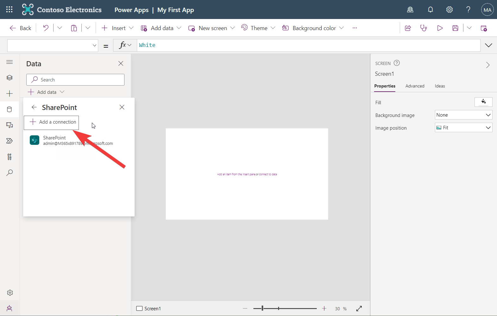
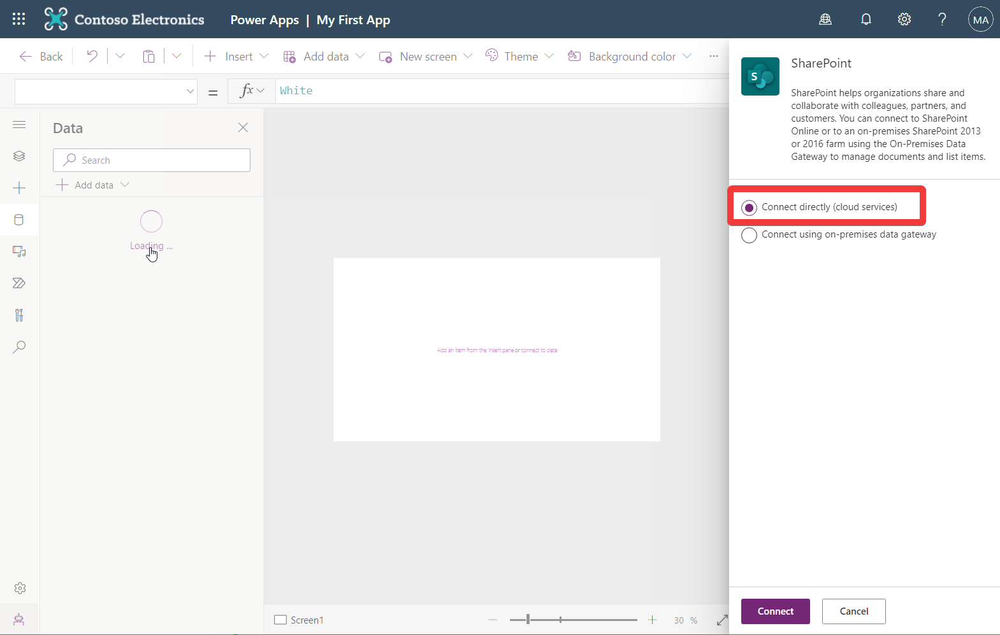
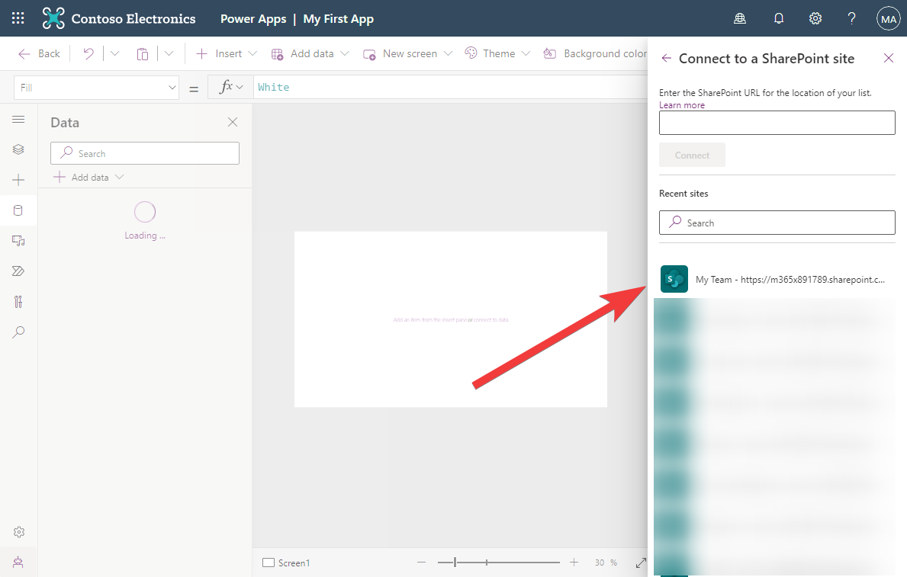
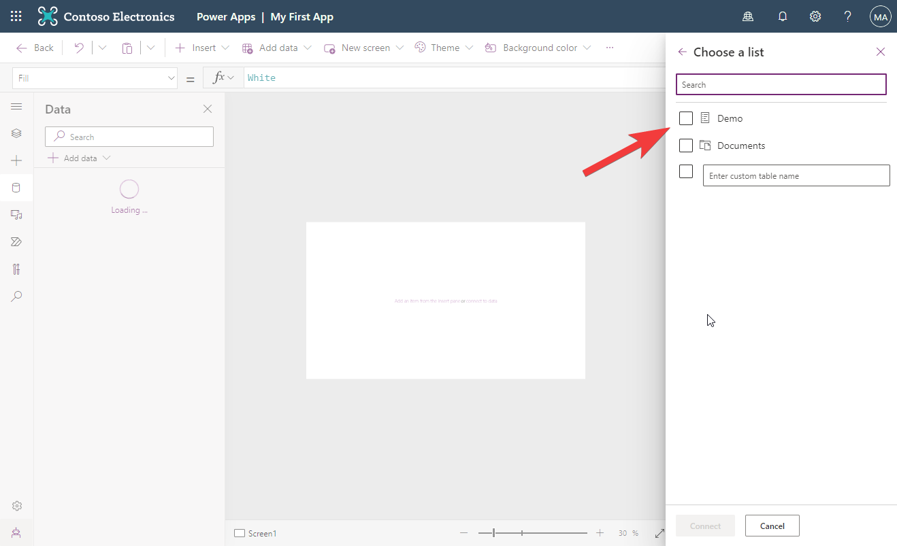
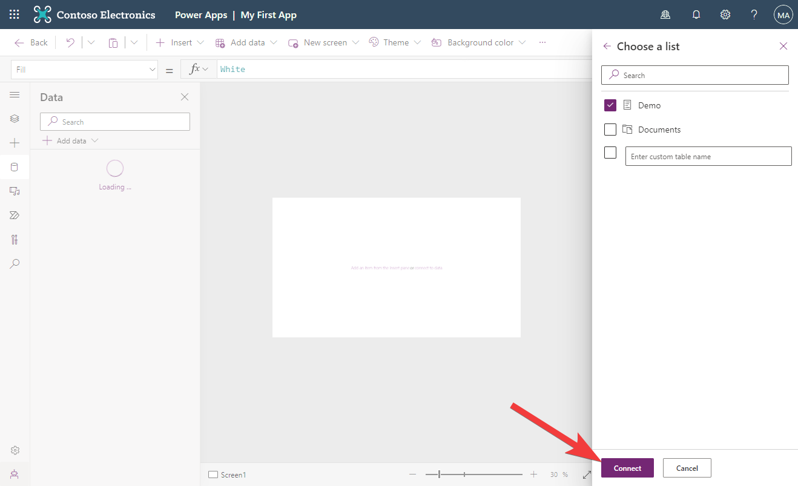
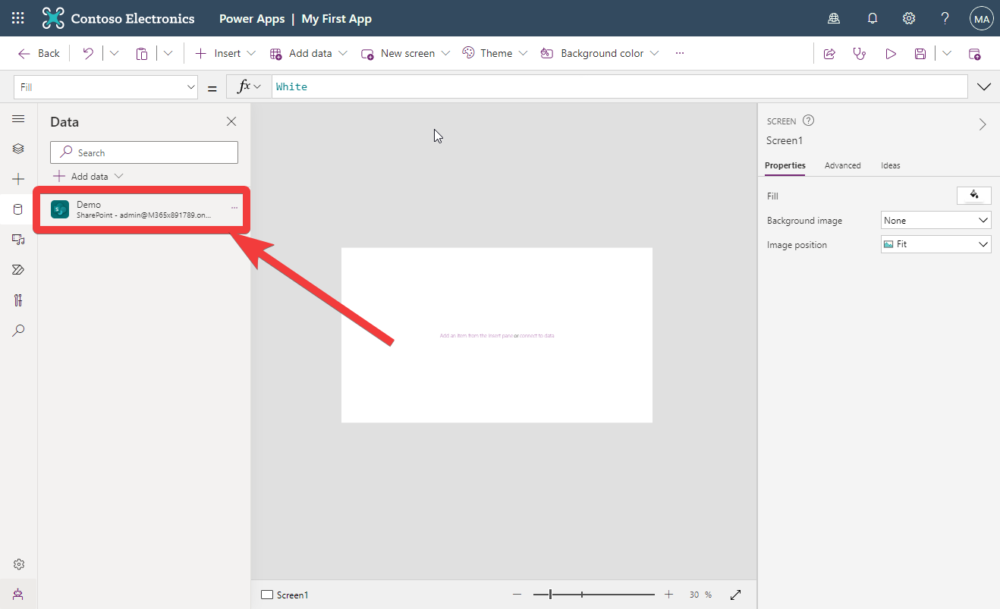

# Connect the List to your App

Head back to your PowerApps 

In my case I opened Teams in a new browser tab, so all I have to do is to select the first tab 

## Open the "Data" panel 

Within the left rail (marked by the surrounding read box), select the database icon 

Select Add data 

## Connect a SharePoint list
Then type in **sharepoint** 

Select the "SharePoint"  

Click Add a connection 

Select **Connect directly (cloud service)**

:::info
Here is becomes tricky. Once you are presented with the **Connect to SharePoint site** panel, you have 2 options. You can either enter the SharePoint URL or select amongst Recent sites.  The later is super handy, but as the list of recent sites have a build in delay, it will not capture if you just have created a list (which is stored in a site, a site which is created automatically when you create a Microsoft Team) 

In this case I have cheated and waited a day for the list to get updated with the Teams that I created earlier, if you haven't got that patience, check 
[Pro tip: How to find the SharePoint URL](../../pro-tips/how-to-find-the-SharePoint-URL/index.md)
:::

Select **My Team ..."**

Then select **Demo**

Click **Connect**
## Verify Connections

Verify that  shows in the Data panel