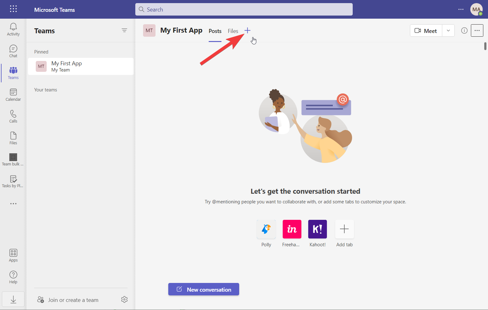
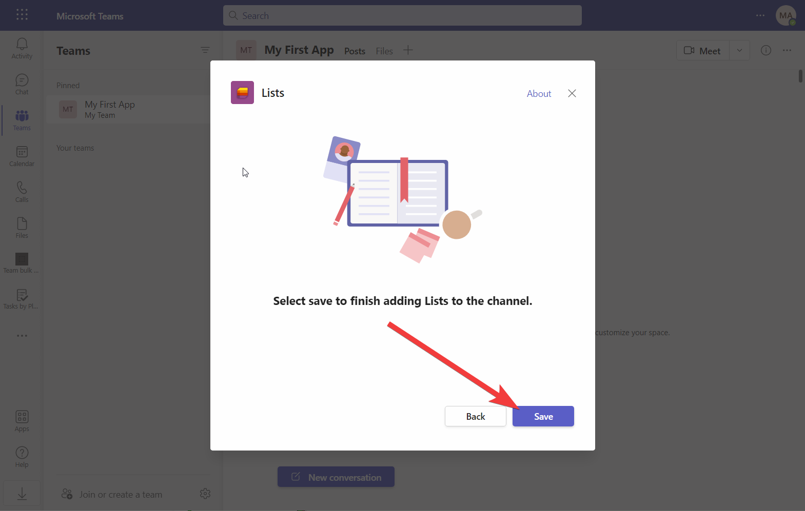
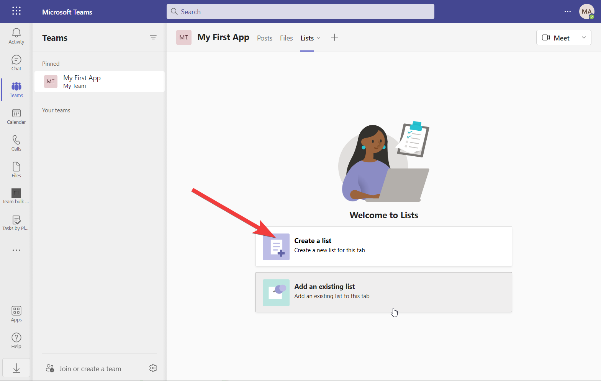
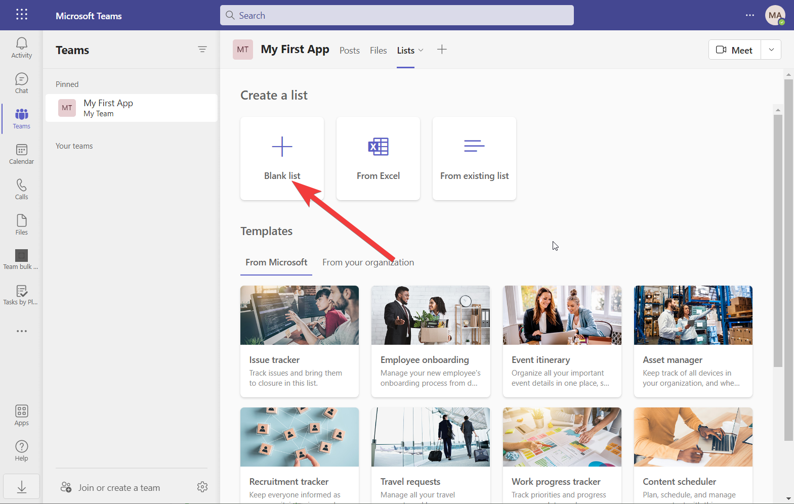
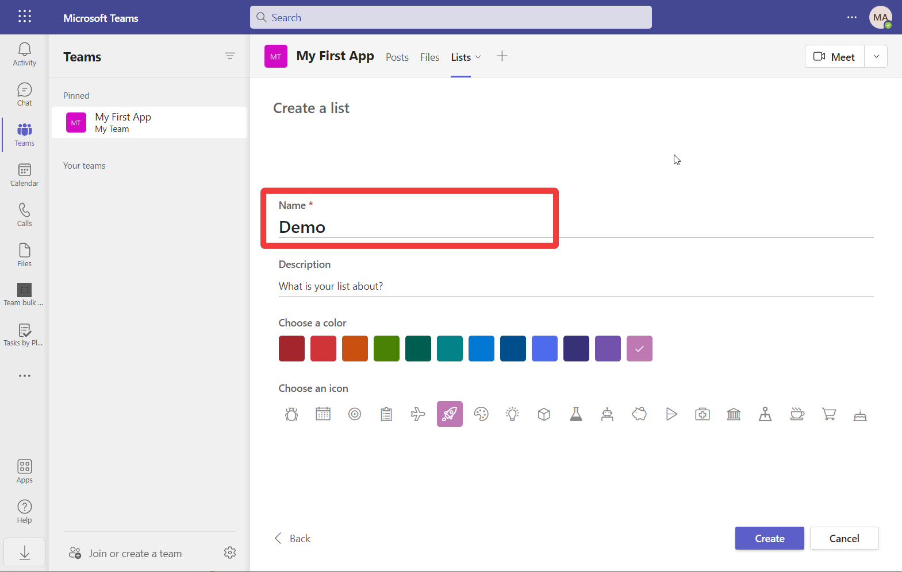
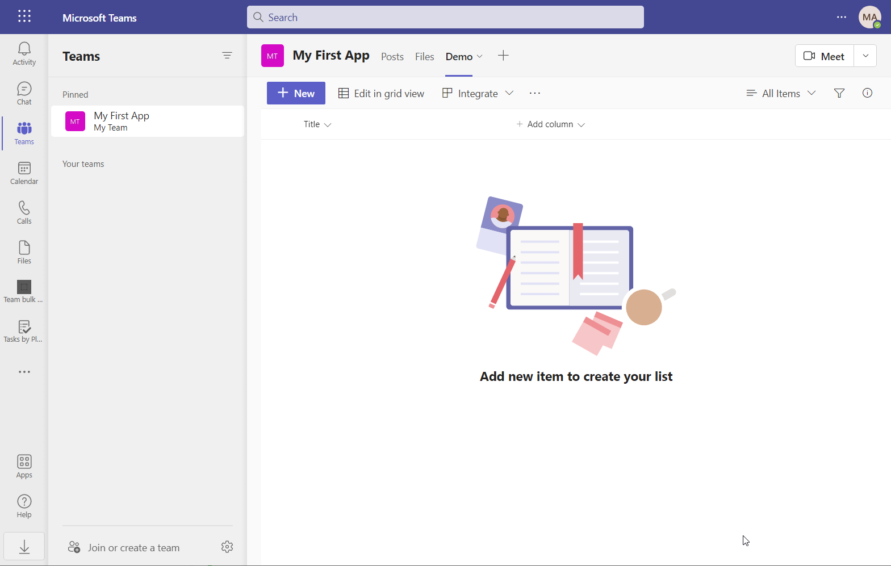
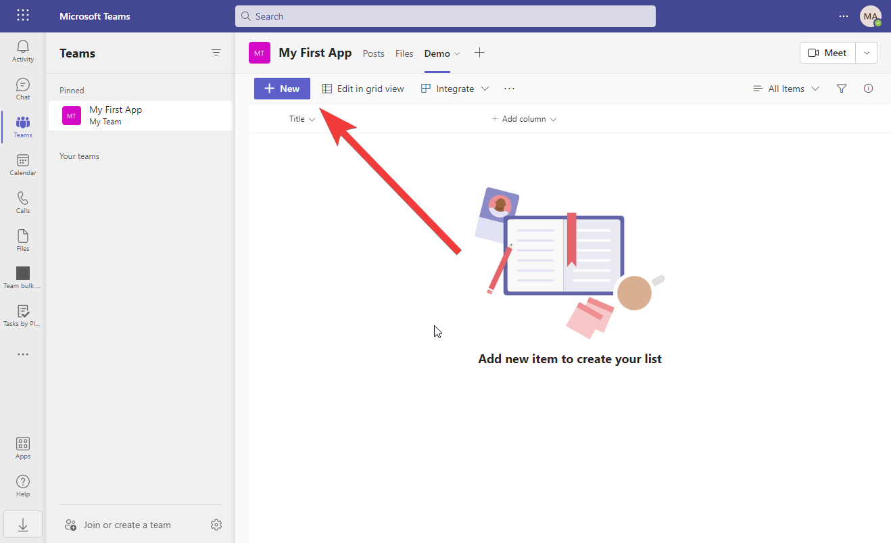
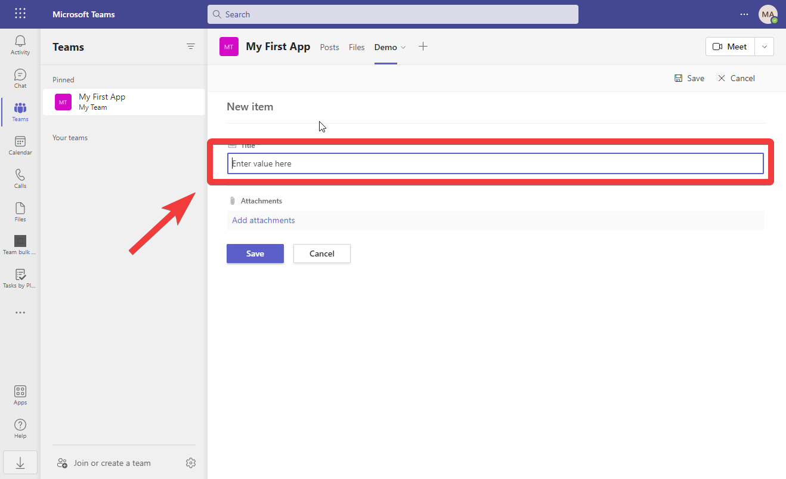
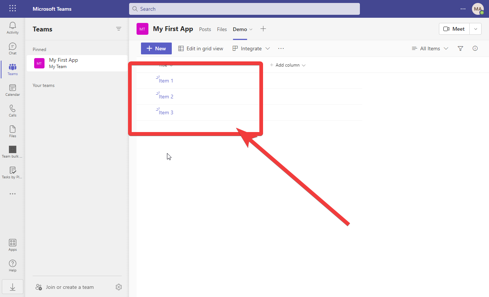

# Create a List

A list is like a worksheet in a spreadsheet, a place to store structured information. You can look at it as a table in a database.

## Add a Tab in Teams

In this case I will work under the assumption that you uses Microsoft Teams, and that you are the owner of one. Navigate to the channel where you like to add a List. 

**Click** the plus icon to add a new tab
## Add a List Tab

Find the **Lists** icon, click on it

Select **save** to finish adding Lists to the channel.

## Create a list

Select **Create a list**

Select **Blank list**

Name the list **Demo** 

:::tip Pro tip
We have a Pro tip for you on the concept of naming conventions. See [Use PascalCasing](../../pro-tips/name-using-pascal-casing)
:::

Name the list **Demo** and select **Create**

## Add a few items to the list

Click 

Enter the name of the first item, name it e.g. **Item 1** and select **Save**

Repeat the step a few time and name the next items **Item 2**, **Item 3** etc.

You should end up having at least 3 items

## Disclaimer

Lists can be used for a lot. Lists is stored in SharePoint, so when you create a Microsoft Teams Team, you implicitly creates a SharePoint site. Lists have some limitations though. To be on the safe side, you will have no problems using Lists for your application if you store less than 500 items (can be increased to 2000). But if you design your" data model" right, there is practically no limits to how many items you store in your lists, the 2000 items limit is only affecting the view of items.

