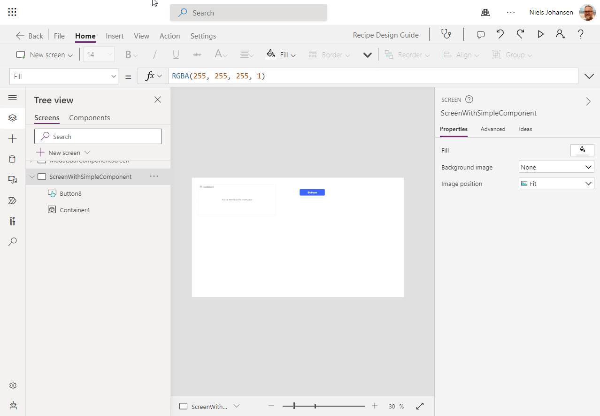
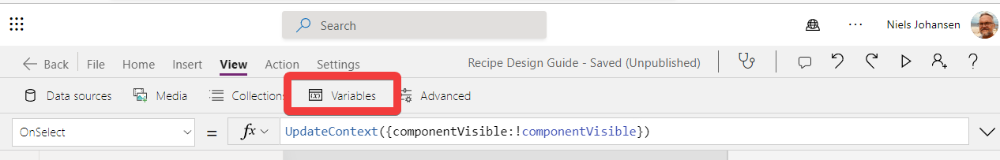
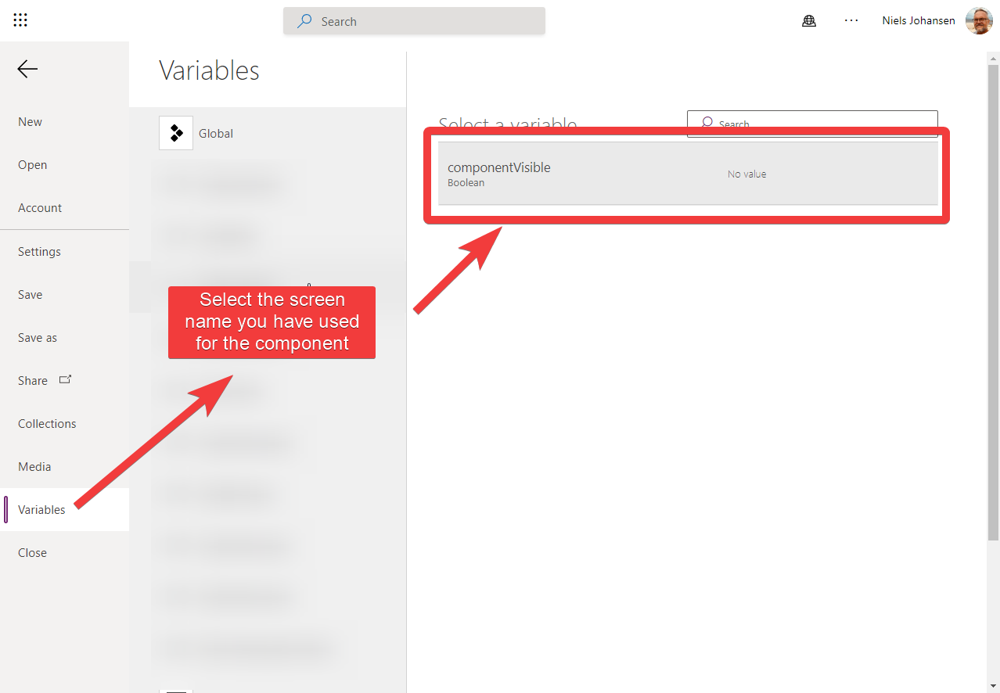

# Reusability

The `KISS´ principle is a good starting point for designing your app. However, you will find that you will need to reuse components in your app. This is especially true if you are building a large app. Reusing components will help you to reduce the amount of code you need to write and maintain. It will also help you to reduce the amount of time it takes to build your app.

## Components in PowerApps

### `Professional` components

Power Apps component framework (PCF) is a framework that enables you to build custom components for Power Apps. You can use PCF to build custom components that you can use in your apps. You can also use PCF to build custom components that you can share with other users. You can find more information about PCF in the [Power Apps component framework documentation](https://learn.microsoft.com/en-us/power-apps/developer/component-framework/overview).

:::warning "Arguments against using PCF"
You will be require to have access to a developer, or you will need to learn how to build your own components. This will require you to have some knowledge of JavaScript and TypeScript. You will also need to have access to Visual Studio Code or Visual Studio 2019. You will also need to have access to a Power Apps environment. You will need to have access to a Power Apps environment that has the Power Apps component framework enabled. You can find more information about how to enable the Power Apps component framework in the [Power Apps component framework documentation](https://docs.microsoft.com/en-us/powerapps/developer/component-framework/enable-pcf).

You will also be faced with the need for  Application Life-Cycle Management (ALM)

:::

### `Canvas App` components
PowerApps Canvas components are a set of components that you can use in your Canvas apps. You can find more information about Canvas components in the [PowerApps Canvas components documentation](https://learn.microsoft.com/en-us/power-apps/maker/canvas-apps/create-component).


## Components the "copy and paste" way
:::info This is our recommendation
We recommend that you use the `copy and paste` way of reusing components. This is because it is the easiest way to reuse components. It is also the most flexible way to reuse components. You can use the `copy and paste` way of reusing components in all versions of PowerApps and also across different versions of PowerApps  / different environments / different tenants.
:::

### Ingredients for a component

#### Container
The Container is what encapsulates your component. The visibility of the container should be controlled, on the form, by a variable. The variable should be set to `true` when the component should be visible and `false` when the component should be hidden.



```javascript title="Button: OnSelect"
// This will both define the variable componentVisible as well as making it become true if it was false and vice versa

UpdateContext({componentVisible:!componentVisible})
```  

```javascript title="Container: Visible"
componentVisible
```  

You can check the current value of the variable `componentVisible` using the Variables



